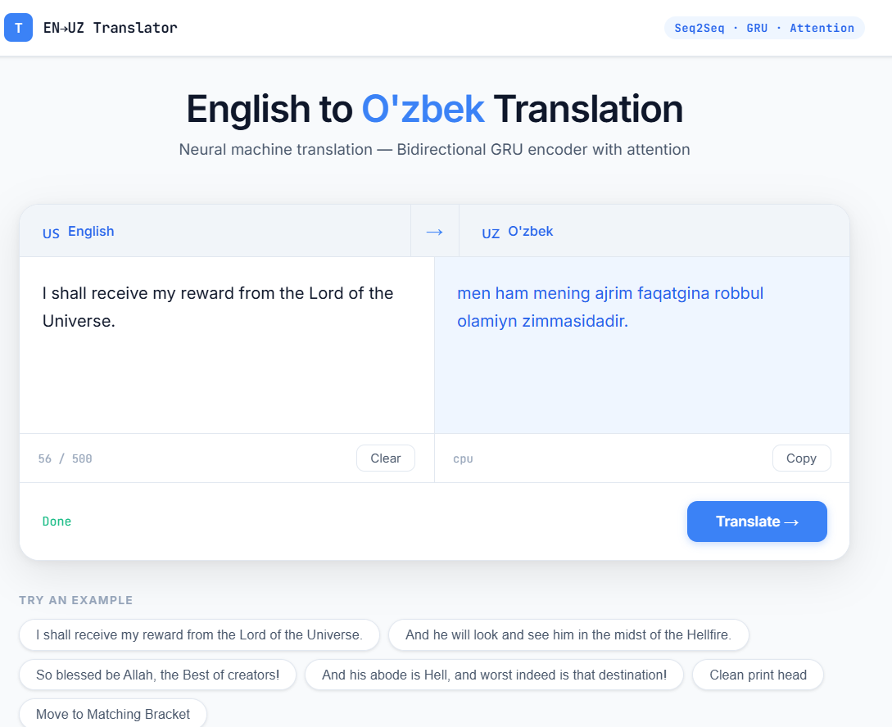

# EN → UZ Translator

A small web app that translates English text into Uzbek. Built a Seq2Seq model from scratch using PyTorch, then wrapped it in a FastAPI backend with a simple frontend.

---

---

## How it works

The model is a classic Seq2Seq architecture — bidirectional GRU encoder, attention mechanism, and a GRU decoder. Trained on an English-Uzbek parallel corpus (~100k sentence pairs).

```
English input
     ↓
Bidirectional GRU Encoder
     ↓
Attention
     ↓
GRU Decoder
     ↓
Uzbek output
```

---

## Stack

- **PyTorch** — model training and inference
- **FastAPI** — backend API
- **HTML/CSS/JS** — single page frontend

---

## Run locally

```bash
git clone https://github.com/Sanjarbek1024/en_uz_translator.git
cd en_uz_translator

python -m venv venv
venv\Scripts\activate       # Windows
source venv/bin/activate    # Mac/Linux

pip install -r requirements.txt
```

Download the model checkpoint and place it here:
```
saved_model/full_seq2seq_checkpoint.pth
```

Then start the server:
```bash
uvicorn main:app --reload --host 0.0.0.0 --port 8000
```

Open `http://localhost:8000` in your browser.

---

## API

```
POST /translate
{ "text": "Indeed, Allah is Forgiving and Merciful." }
```

```json
{
  "input": "Indeed, Allah is Forgiving and Merciful.",
  "translation": "darhaqiqat, alloh mag'firat qiluvchi va rahm qiluvchidir.",
  "device": "cpu"
}
```

---

## Notes

The model was trained for 5 epochs on short sentences (max 30 tokens), so it works best on simple, clean input. Longer or complex sentences may not translate well — that's expected for a first version.

---

Made by [Sanjarbek G'ulomjonov](https://github.com/Sanjarbek1024)