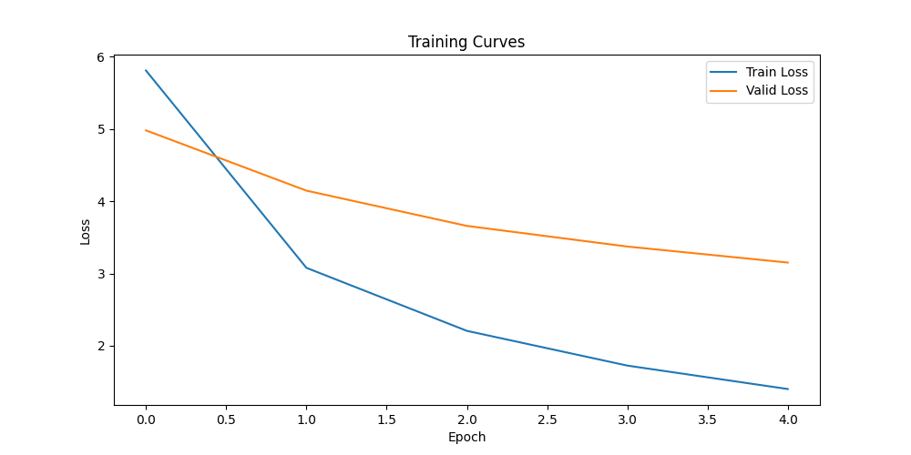

# EN → UZ Neural Translator

A **Seq2Seq translation web app** (English → Uzbek) built with:
- **PyTorch** — Bidirectional GRU Encoder + Attention + GRU Decoder
- **FastAPI** — REST API backend
- **Vanilla HTML/CSS/JS** — Professional green-themed single-page frontend

---

## Project Structure

```
en_uz_translator/
│
├── app/
│   ├── __init__.py
│   └── model.py          ← Encoder, Attention, Decoder, Seq2Seq, translate_sentence()
│
├── templates/
│   └── index.html        ← Frontend (green dark theme)
│
├── static/               ← (empty, reserved for future assets)
│
├── saved_model/
│   └── full_seq2seq_checkpoint.pth   ← Your trained model (add manually)
│
├── main.py               ← FastAPI app entry point
├── requirements.txt
├── .gitignore
└── README.md
```

---

## Quick Start

### 1. Clone the repo

```bash
git clone https://github.com/Sanjarbek1024/en_uz_translator.git
cd en_uz_translator
```

### 2. Create virtual environment

```bash
python -m venv venv

# Windows
venv\Scripts\activate

# macOS / Linux
source venv/bin/activate
```

### 3. Install dependencies

```bash
pip install -r requirements.txt
```

### 4. Add your model checkpoint

Copy your trained checkpoint into the `saved_model/` folder:

```
saved_model/full_seq2seq_checkpoint.pth
```

This is the file saved by the training notebook:
```python
torch.save(checkpoint, "saved_model/full_seq2seq_checkpoint.pth")
```

### 5. Run the server

```bash
uvicorn main:app --reload --host 0.0.0.0 --port 8000
```

Open: [http://localhost:8000](http://localhost:8000)

---

## API Endpoints

| Method | Path         | Description              |
|--------|--------------|--------------------------|
| GET    | `/`          | Serves the frontend HTML |
| POST   | `/translate` | Translate EN → UZ        |
| GET    | `/health`    | Model status check       |

### POST /translate

**Request:**
```json
{ "text": "Indeed, Allah is Forgiving and Merciful." }
```

**Response:**
```json
{
  "input": "Indeed, Allah is Forgiving and Merciful.",
  "translation": "darhaqiqat, alloh mag'firat qiluvchi va rahm qiluvchidir.",
  "device": "cpu"
}
```

---

## Keyboard Shortcut

Press `Ctrl + Enter` (or `Cmd + Enter` on Mac) to translate.

---

## GitHub Deploy

```bash
# First time
git init
git add .
git commit -m "Initial commit — EN→UZ translator app"
git branch -M main
git remote add origin https://github.com/Sanjarbek1024/en_uz_translator.git
git push -u origin main

# After changes
git add .
git commit -m "Update: describe your change"
git push
```

> **Note:** The model checkpoint (`.pth`) is excluded from git via `.gitignore`
> because it is a large binary file. Host it on Google Drive, Hugging Face Hub,
> or similar and document the download link here.

---

## Model Architecture

```
Input (English)
       ↓
  Embedding Layer
       ↓
 Bidirectional GRU  (Encoder)
       ↓
  Attention Layer   (scores over encoder outputs)
       ↓
    GRU Decoder     (one token at a time)
       ↓
  Linear (fc_out)
       ↓
Output (Uzbek)
```

**Hyperparameters:**
| Parameter       | Value |
|-----------------|-------|
| EMBED_SIZE      | 256   |
| HIDDEN_SIZE     | 256   |
| NUM_LAYERS      | 1     |
| DROPOUT         | 0.3   |
| MAX_LENGTH      | 30    |
| BATCH_SIZE      | 128   |

---


---
## Author

**Sanjarbek Gulomjonov** — AI & Data Engineering student

